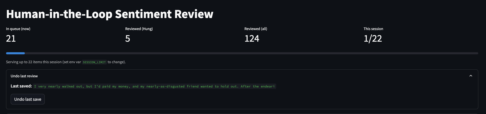

# Auto-Annotation (Sentiment)

# Auto-Annotation (Sentiment) — Results Snapshot

**Data:** 2000 texts  
**Routing thresholds:** `tau_auto_accept=0.9997697472572327`, `tau_review=0.95`

## 1. Summary 
Human-in-the-loop sentiment auto-annotation: transformer prelabels text → confidence routing (auto-accept / review / hard-case) → Streamlit review UI with progress & undo → shadow audits report precision (95% CI).

## 2. Problem statement 

## 3. Quickstart (commands)
```
python3 -m venv .venv && source .venv/bin/activate
python -m pip install -U pip && pip install -r requirements.txt
python src/model_prelabel.py
python src/router.py
SESSION_LIMIT=10 REVIEWER_NAME="DemoUser" streamlit run app/review_app.py --server.port 8502

```

## 4. Shadow audit & report 
```
python src/shadow_audit_sample.py 30
SESSION_LIMIT=30 streamlit run app/review_app.py --server.port 8502
python src/auto_accept_precision.py
python src/report.py   # regenerates reports/README_results.md
```

## 5. Configuration
- configs/config.yaml → set thresholds:
  - routing.tau_auto_accept (auto-accept cutoff)
  - routing.tau_review (hard-case cutoff)

- Env vars: SESSION_LIMIT (items per session), REVIEWER_NAME (for audit trail).

## 6. Screenshot of the UI
```




```

## 7. Repo structure
```
app/ (Streamlit UI)       src/ (prelabel, router, audits, report)
configs/                  data/processed/ (artifacts, gitignored)
queues/, labels/          reports/ (snapshot md + metrics.json)
```

## 8. Policy
Labels: POSITIVE vs NEGATIVE (civility ≠ positivity; negative but non-abusive is valid NEGATIVE).

## Current Counts
- Auto-accepted: **100**
- Review queue: **22**
- Hard-case queue: **182**
- Reviewed (total): **123**
- Audited auto-accepts (subset): **0**

## Quality
- Model vs reviewer agreement (on all reviewed): **1.000**
- Auto-accept precision (shadow audit): **0.971-1.0** (95% CI: **0.971-1.0**)

## Threshold justification
Confidence quantiles (pred_conf): `{'0.95': 0.9997695207595825, '0.97': 0.9997857248783112, '0.98': 0.9997946691513061, '0.99': 0.9998058724403381, '0.995': 0.9998114705085754, '0.999': 0.9998196967840195}`

*Generated 2025-08-21T15:25:56.941530Z*
